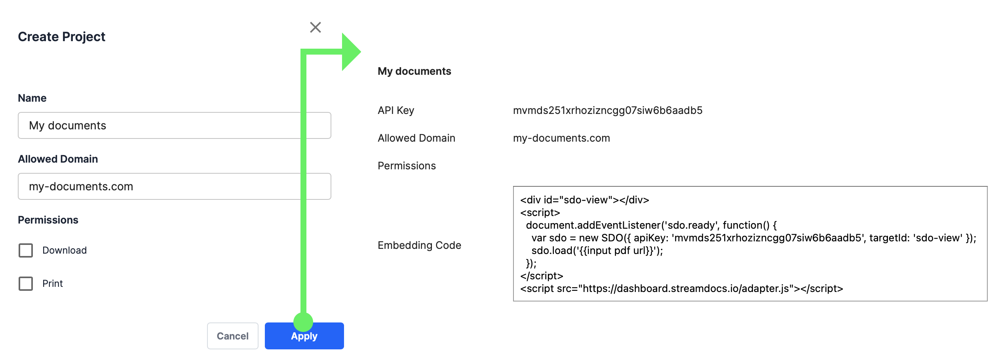

.. Copyright (C) 2001-2023 Artifex Software, Inc.
.. All Rights Reserved.

.. meta::
   :description: StreamDocs Online documentation
   :keywords: StreamDocs, doc, xls, pdf, ppt, docx, xlsx, pptx

.. include:: header.rst

Getting Started
===============================

To get started with :title:`StreamDocs` ensure that you have registered for the service so you can access the `StreamDocs Dashboard`_, create projects and get access to your API Keys.
:title:`StreamDocs` assumes no specific web environment or framework, but of course you can use whatever suits your project. It's up to you!

.. note:: :title:`Browser support`

   :title:`StreamDocs` embedding does not currently work for the :title:`Safari` browser. This will be addressed soon.

Creating a Project
~~~~~~~~~~~~~~~~~~~~~~

The first stage in `StreamDocs Dashboard`_ should be to create a project. Projects allow you to assign specific domains and permissions for use with your documents.
Projects contain API Keys which will operate only for the specified domain. In this way you have access control over your PDFs.

   The StreamDocs dashboard project creation UI

Here you can set your allowed domain and permissions for downloading or printing.

.. note::

   The "allowed domain" refers to the domain which is allowed for :title:`StreamDocs` to operate on, however your documents do not need to reside on this domain. In this way your API Key is tied to your website domain, but your documents can come from anywhere.

Projects on local host
"""""""""""""""""""""""

If you have a local host environment, you can supply a Project with the domain defined as `localhost`.

In this way you can easily test your :title:`StreamDocs` integration on your local machine.

.. raw:: html

   

   <figure>
   <figcaption>

   A simple local host project example
   

   </figcaption>
   </figure>

API Keys
~~~~~~~~~~~~~~~~~~~~~~

Once a project is created you can easily see your API Key.

To embed a document viewer into a target `div` just copy the sample code snippet and paste it into your HTML page.

.. raw:: html

   <pre>
     <code class="language-javascript" data-prismjs-copy="Copy">
       &lt;div id="sdo-view"&gt;&lt;/div&gt;
       &lt;script&gt;
         document.addEventListener('sdo.ready', function() {
           const sdo = new SDO({ apiKey: 'your_api_key', targetId: 'sdo-view' });
           sdo.load('input_pdf_url');
         });
       &lt;/script&gt;
       &lt;script src="https://dashboard.streamdocs.io/adapter.js"&gt;&lt;/script&gt;
     </code>
   </pre>

   <!-- this is a code caption, but uses the standard imge caption structure
      so it looks the same as an image caption -->
   <figure>
   <figcaption>

   JavaScript embedding code from the <strong>StreamDocs</strong> Dashboard
   

   </figcaption>
   </figure>

.. note::

   Ensure to substitute `input_pdf_url` for your own PDF file reference.

And that's it! Simply host the :title:`JavaScript` code within yor webpage on the defined domain and you should see the :title:`PDF` on the page.

.. External links

.. _StreamDocs Dashboard: https://dashboard.streamdocs.io

.. include:: footer.rst
